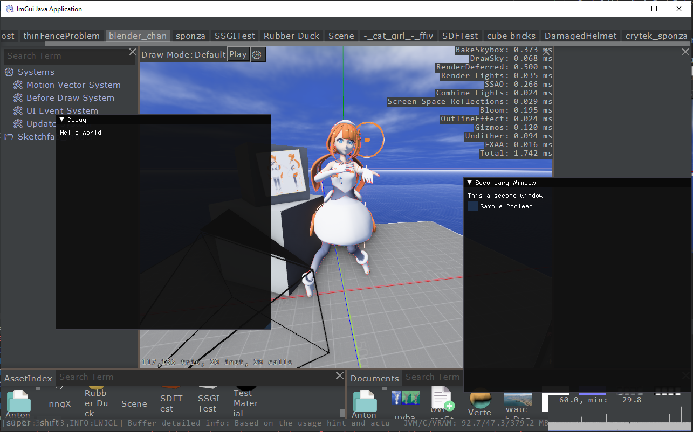
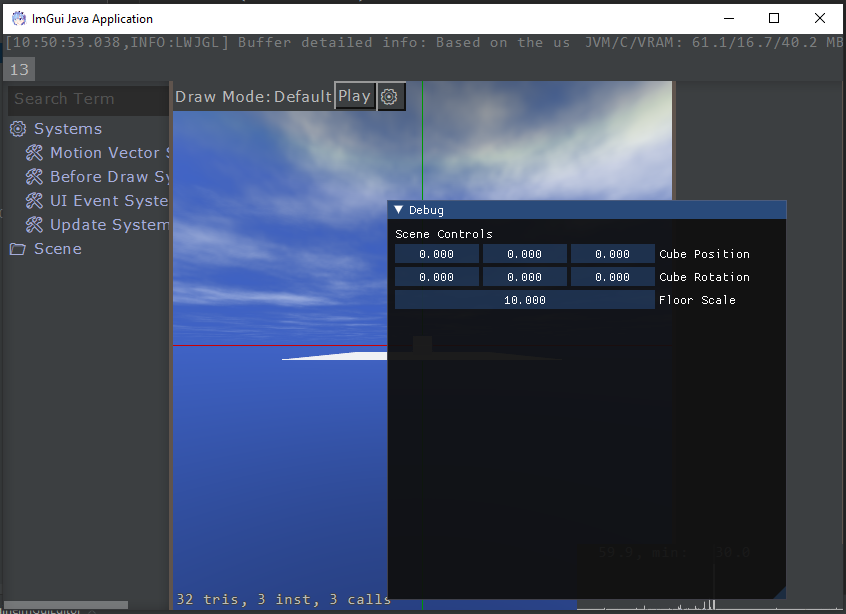
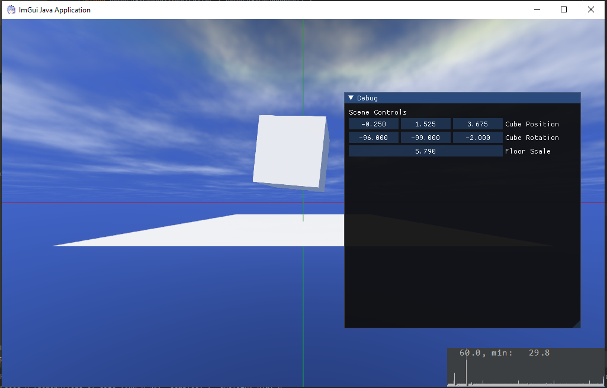

# RemsImGUI

DearImGui-integration for Rem's Engine. Uses [github.com/SpaiR/imgui-java](https://github.com/SpaiR/imgui-java).

**Here are a few first results:**

Running the standard Rem's Engine editor in combination with ImGui:

Controls for elements in the scene using ImGui, still with a few default controls:

Controls for scene elements, without any extra controls:
